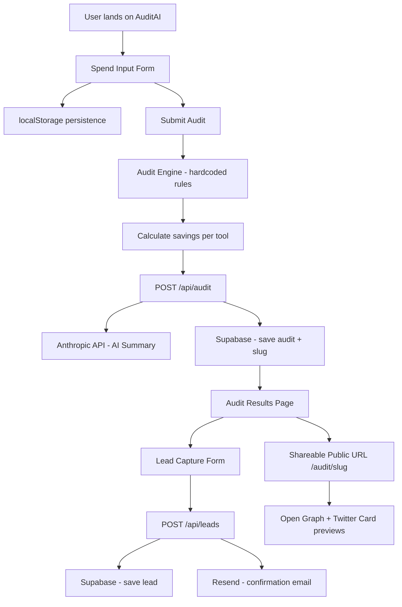

# ARCHITECTURE.md

## System Diagram

## Data Flow

1. User fills spend input form → stored in localStorage
2. On submit → audit engine runs client-side calculations
3. Results POST'd to `/api/audit` → saved to Supabase with unique slug
4. Anthropic API generates personalized summary (fallback to template on failure)
5. User sees results page at `/audit/[slug]`
6. User optionally submits email → stored in Supabase leads table
7. Resend sends confirmation email
8. Public shareable URL strips PII, shows tools + savings

## Why This Stack

- **Next.js App Router** — SSR for shareable URLs with proper OG tags, API routes built-in, no separate backend needed
- **TypeScript** — Type safety across audit engine prevents calculation bugs
- **Tailwind + shadcn/ui** — Rapid UI development with accessible, unstyled primitives
- **Supabase** — Managed Postgres with RLS, real-time, generous free tier, no DevOps needed
- **Vercel** — Zero-config Next.js hosting, auto-deploy on push, edge network
- **Vitest** — 10× faster than Jest for unit testing audit engine logic
- **Anthropic API** — Claude produces more nuanced financial summaries than GPT-3.5

## What I'd Change at 10k Audits/Day

- Add Redis (Upstash) for rate limiting and caching repeated audit patterns
- Move audit engine to Edge Functions for lower latency
- Add a job queue (Inngest) for async email sending
- Replace Supabase free tier with dedicated Postgres on Render
- Add CDN caching for public shareable audit pages
- Instrument with PostHog for funnel analytics